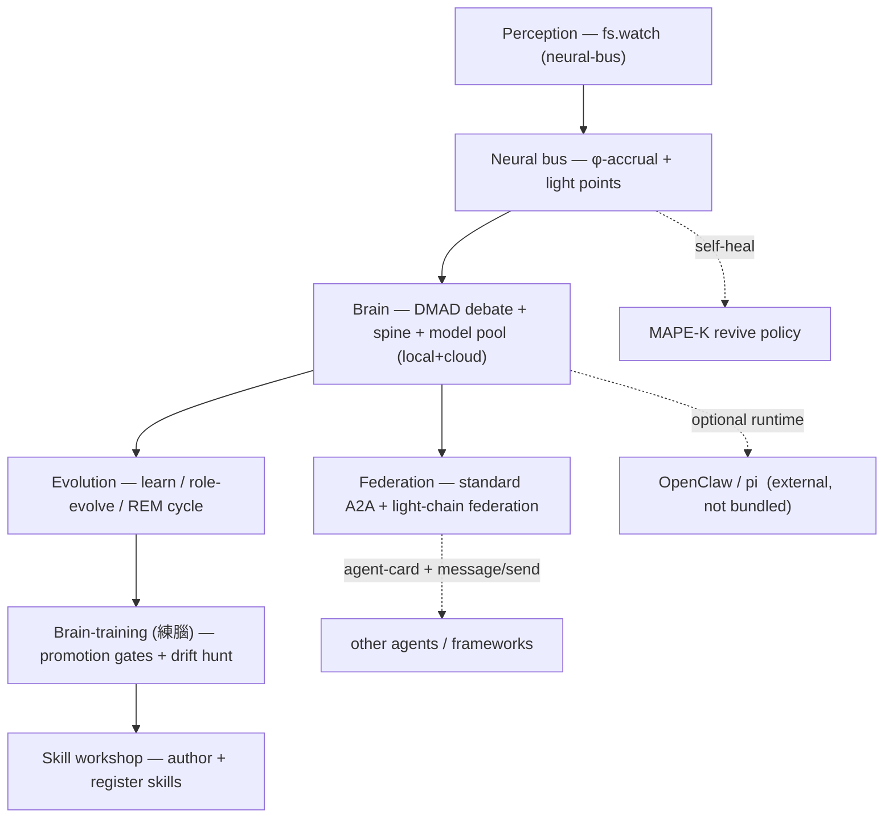

# LumenChain (光鏈)

> An **open, resilient multi-agent cognitive stack** — agents are *neurons* on a *light-chain* that **perceive, debate, learn, self-heal, and federate**. Run it alongside LangGraph / CrewAI / AutoGen to add the reliability and collaboration layer they're missing.

[](LICENSE)

**This is a community-friendly monorepo — contributions welcome.** See [CONTRIBUTING.md](CONTRIBUTING.md).

---

## Why LumenChain

Most agent frameworks are great at *wiring* agents together but weak on two things production teams keep hitting:

1. **Reliability.** When an agent keeps dying, frameworks blindly retry. LumenChain's neural bus uses **φ-accrual failure detection + MAPE-K self-healing** to *retire* dying neurons instead of reviving them forever.
2. **Real collaboration.** Agents that actually **debate** and **federate**, not just hand off. LumenChain ships **DMAD multi-agent debate** and a **standards-based A2A** layer.

It is **not** another framework to migrate to — the cognitive layer is independent and composes with whatever you already run. Five of six packages have **zero runtime dependencies** (pure Node standard library).

## Packages

| Package | What it does | Deps |
|---|---|---|
| [`@lumenchain/neural-bus`](packages/neural-bus) | Perception (`fs.watch`) + sharded light-point bus, **φ-accrual** failure detection, **MAPE-K** self-healing, + 12 knowledge-graph schemas | **none** |
| [`@lumenchain/brain`](packages/brain) | **DMAD multi-agent debate**, cognitive **spine**, multi-brain MCP wrappers, + **local+cloud model pool** (Ollama + 47 cloud providers, VRAM-aware fallback) | **none** |
| [`@lumenchain/brain-training`](packages/brain-training) | **練腦** — promotion gates, drift detection/hunting, pattern auto-promotion | **none** |
| [`@lumenchain/federation`](packages/federation) | **Standard A2A** (Agent Card + `message/send` JSON-RPC) + light-chain federation, cross-spine dispatch | **none** |
| [`evomind`](packages/evolution) | Self-evolving learning: constitutional reasoning, graph-of-thoughts, reflexion, REM-cycle, subscription-aware cost governance | minimal |
| [`@lumenchain/skill-workshop`](packages/skill-workshop) | Author, validate and register agent skills | `@sinclair/typebox` |

## Standards-based A2A (the interop hook)

[`@lumenchain/federation/a2a`](packages/federation/src/a2a) is a **zero-dependency, spec-aligned [Agent2Agent](https://a2a-protocol.org/) implementation** — the open standard 150+ organizations are adopting for cross-framework agent interop:

- serves an **Agent Card** at `/.well-known/agent-card.json` (agent discovery, RFC 8615)
- handles **`message/send`** (JSON-RPC 2.0 over HTTP)
- client helpers `discoverAgent()` + `sendMessage()`
- **fuses** your existing capability manifests into standard Agent Cards via `cardFromManifests()`

```js
import { cardFromManifests, createA2AServer } from "@lumenchain/federation/a2a";

const card = cardFromManifests({
  name: "My Agent",
  url: "https://me.example/",
  manifests, // your existing capability manifests
});
const { listen } = createA2AServer({ card, handler: async ({ text }) => myAgent(text) });
await listen(41241); // now discoverable + callable by any A2A client
```

## The stack



Full design and attribution: [docs/ARCHITECTURE.zh-Hant.md](docs/ARCHITECTURE.zh-Hant.md).

## Install / develop

```bash
git clone https://github.com/yuye7973/lumenchain.git
cd lumenchain
npm install                      # installs all workspaces
npm test -w @lumenchain/brain    # run a package's tests
```

Run the perception watcher:

```bash
NEURAL_BUS_DIR=./.neural-bus npx -w @lumenchain/neural-bus lumenchain-watcher
```

## Compute pool (local + cloud)

`@lumenchain/brain`'s model pool unifies **local Ollama models** and **47+ cloud providers** behind one selector with VRAM-aware fallback — bring your own keys via environment variables (e.g. `OPENROUTER_API_KEY`). Nothing is hardcoded; no keys ship in the repo.

## Contributing

LumenChain is built to be built *on*. Good places to start:

- **A2A**: extend the A2A layer with streaming (`message/stream` / SSE) or push notifications.
- **Self-healing**: add revive-policy strategies to `neural-bus`.
- **Debate**: contribute new DMAD debate/aggregation patterns to `brain`.
- **Skills**: publish reusable skills via `skill-workshop`.

See [CONTRIBUTING.md](CONTRIBUTING.md) and issues tagged `good first issue`.

## Attribution

LumenChain interoperates with [OpenClaw](https://github.com/openclaw/openclaw) and the `pi` agent framework. Those projects belong to their respective authors and are **not** included here; LumenChain only provides the original cognitive / orchestration layer.

## License

[MIT](LICENSE) © Ming-Hsiu Yeh ([@yuye7973](https://github.com/yuye7973))
